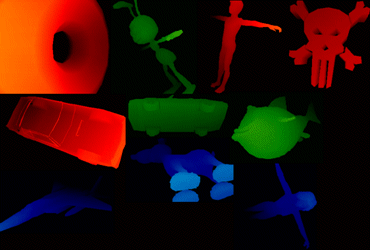



## A 3D Gouraud Shading w/o Blur Motion\. Pure VB \*UPDATED\*

### Description

Rotation with Gouraud Shading its in *Pure VB* (only DirectX 7.0 initialization fullscreen mode, if you want to see rotating meshes in full screen). Runs faster on my K6-2 350Mhz, with 16 Mb Voodoo card, so imagine on Pentium IV or Athlon 2000 Mhz with ATI or nVidia card! xD. See screenShot to believe me. This source its a modification of 3DvbBlurMotion (see CodeId:51406). There is a flag to run the source at fullscreen mode (320x240 at 16 bpp). Use the keys Z,X or Y to change speed rotation. There is a flag to make blur motion to the mesh.I included a short "howto" txt file if you want to make your own meshes. Reports will be apreciated. Thanks for optimizations to Carles P.V. Enjoy it!

*** UPDATE *** I just update more meshes, now are 28. The new meshes aren't LOW POLY optimizated. See READMEFIRST.txt for performance testing and other information.

PSC don't let me upload this new meshes files. You can download from here:

http://www.geocities.com/vbrules2k/meshes.zip (585 Kb aprox.) Sorry for this "trouble". See You, and thanks 4 the votes!
 
### More Info
 

             |
---                |---
**Submitted On**   |2004-04-07 21:54:28
**By**             |[John Ripper](https://github.com/Planet-Source-Code/PSCIndex/blob/master/ByAuthor/john-ripper.md)
**Level**          |Intermediate
**User Rating**    |4.9 (69 globes from 14 users)
**Compatibility**  |VB 5\.0, VB 6\.0
**Category**       |[Graphics](https://github.com/Planet-Source-Code/PSCIndex/blob/master/ByCategory/graphics__1-46.md)
**World**          |[Visual Basic](https://github.com/Planet-Source-Code/PSCIndex/blob/master/ByWorld/visual-basic.md)
**Archive File**   |[A\_3D\_Goura173020472004\.zip](https://github.com/Planet-Source-Code/john-ripper-a-3d-gouraud-shading-w-o-blur-motion-pure-vb-updated__1-52955/archive/master.zip)

